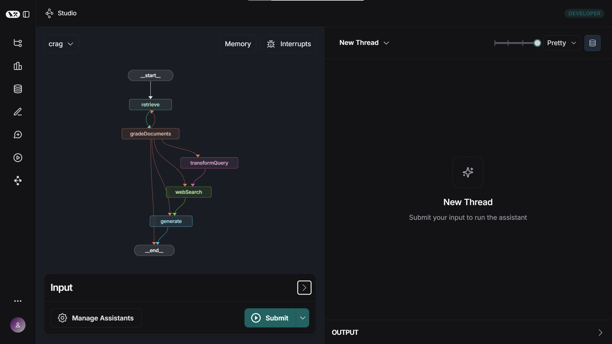

# Various RAG tutorials from LangChain/LangGraph

This repo contains various tutorials found on LangChain or LangGraph's website in regards to Retrieval Augmented Generation

# Setup

Make sure to install dependencies

```bash
pnpm install
```

## Postgres with pgvector

RAG needs a vector database to store embeddings and do similarity search. These tutorials are coded to use a local docker image from [DockerHub/pgvector](https://hub.docker.com/r/pgvector/pgvector)

Use the docker desktop ui to get the image or

```bash
docker pull pgvector/pgvector
```

Run the docker container

```bash
docker run -e POSTGRES_USER=dbuser -e POSTGRES_PASSWORD=dbpassword -e POSTGRES_DB=nuxtragdb --name nuxt_rag_db -p 5432:5432 -d pgvector/pgvector:0.8.0-pg17
```

Where
-e POSTGRES_USER=myuser: Creates a database user
-e POSTGRES_PASSWORD=mypassword: Sets the user's password
-e POSTGRES_DB=mydatabase: Creates a new database
--name my_postgres: Names your container
-p 5432:5432: Maps the container's PostgreSQL port to your host
-d: Runs the container in detached mode

Connect to the postgres instance using [pgAdmin](https://www.pgadmin.org/)

Enable the pgvector extension by running
```sql
CREATE EXTENSION vector;
```

To ensure pgvector is properly installed, run:
```sql
SELECT * FROM pg_extension;
```

## LangGraph Server

Install the local LangGraph Server

```bash
# Or install globally, will be available as `langgraphjs`
npm install -g @langchain/langgraph-cli
```

Launch the LangGraph Server

```bash
$ langgraphjs dev

          Welcome to

╦ ┌─┐┌┐┌┌─┐╔═╗┬─┐┌─┐┌─┐┬ ┬
║ ├─┤││││ ┬║ ╦├┬┘├─┤├─┘├─┤
╩═╝┴ ┴┘└┘└─┘╚═╝┴└─┴ ┴┴ ┴ ┴.js

- 🚀 API: http://localhost:2024
- 🎨 Studio UI: https://smith.langchain.com/studio?baseUrl=http://localhost:2024
```

A browser should be launched to show the LangGraph studio

